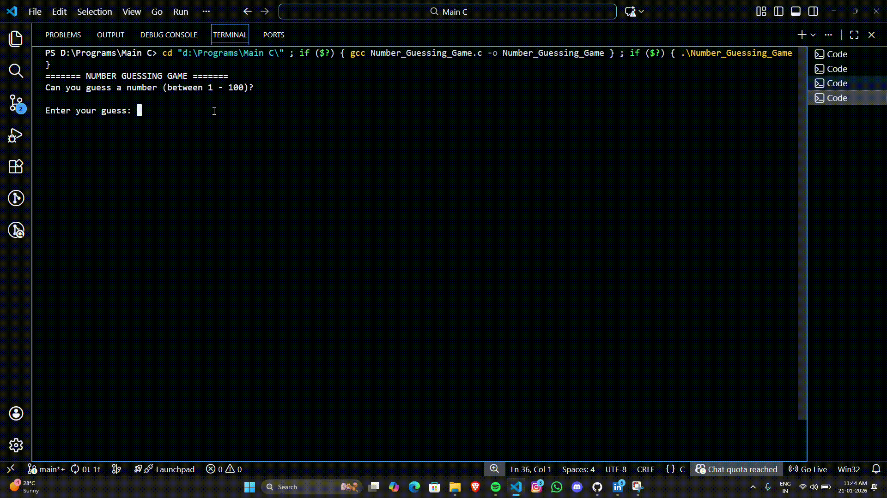

# Number Guessing Game

A simple and interactive command-line Number Guessing Game written in C.

## Demo


## Description
This program randomly generates a secret number between 1 and 100. The player's objective is to guess the secret number. After each attempt, the game provides feedback, indicating whether the guess was "Too High!" or "Too Low!". The game continues until the player successfully guesses the number, after which it displays the total number of attempts taken.

## Features
* **Random Number Generation:** Uses the current time as a seed (`srand(time(0))`) to ensure a unique secret number for every game session.
* **Input Validation:** Checks if the user's input falls within the valid range of 1 to 100 and prompts them again if it does not.
* **Attempt Tracking:** Counts and displays the total number of guesses it took to win.

## How to Run

### Prerequisites
You need a C compiler (such as GCC) installed on your system.

## Compilation
Open your terminal, navigate to the folder containing the file, and compile the code using:
```bash
gcc Number_Guessing_Game.c -o guessing_game
```

## Execution
Run the compiled program:
On Linux/macOS:
```Bash
./guessing_game
```

On Windows:
```DOS
guessing_game.exe
```
