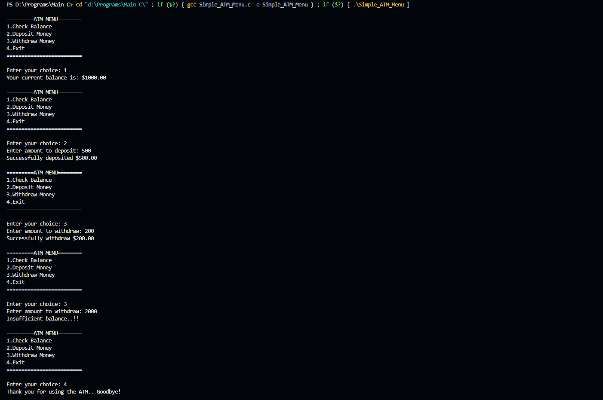

# Simple ATM Menu Simulator
A lightweight, console-based ATM simulator written in C. This program demonstrates foundational programming concepts like functions, infinite loops (`while(1)`), 
conditional logic (`if-else`), and switch-case statements to create a continuous interactive user menu.

## Features
- **Check Balance.**: View the current account balance (starts with a default balance of $1000.00).
- **Deposit Money:** Add funds to the account with validation to prevent negative deposits.
- **Withdraw Money:** Deduct funds from the account. Includes checks for sufficient balance and valid input amounts.
- **Exit:** Safely terminate the ATM session.

## How to Compile and Run
- Clone or Download the repository to your local machine.
- Navigate to the directory containing the file in your terminal.

- **Compile the code using GCC:**

```Bash
gcc simple_ATM_menu.c -o atm
```
**Run the compiled executable:**
- On Linux/macOS:
```Bash
./atm
```
- On Windows:
```DOS
atm.exe
```

## 💻 Example Output Demo


## 👨‍💻 Author
Ahamed Sinan
